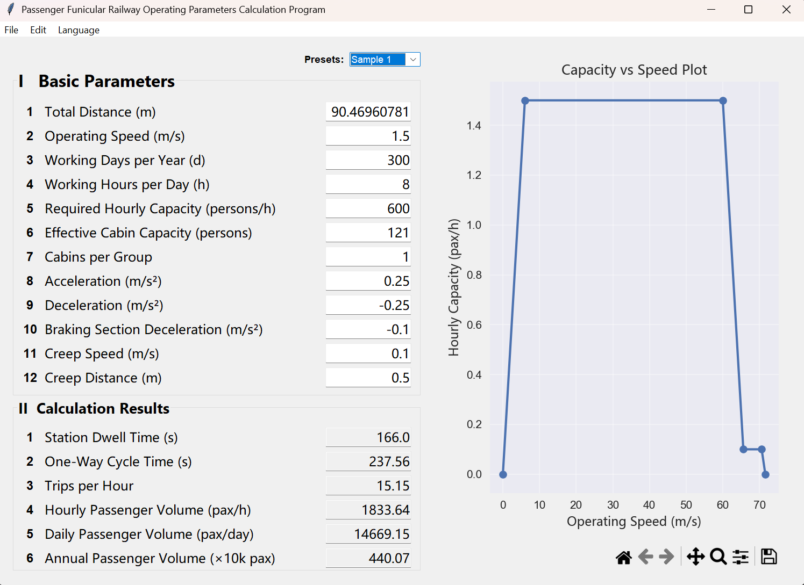

# 🚡 Funicular System Calculation App

[](https://www.python.org/downloads/)
[]()
[](https://creativecommons.org/licenses/by-nc-sa/4.0/)

A modern, object-oriented Tkinter application for calculating operating parameters of passenger funicular railway systems. Built with clean OOP design, modular architecture, and full internationalization support (Chinese/English).

---

## ✨ Features

- 📊 **Interactive Tables** — Real-time data input with live calculation preview
- 📈 **Matplotlib Visualization** — Dynamic velocity-time profile preview
- 🌍 **Multilingual Support** — Seamless switching between mutilple languages
- 💾 **Preset Management** — Save, load, and apply preset configurations
- 🎨 **Modern GUI** — Clean Tkinter interface with responsive layout
- 🔧 **Scalable Architecture** — OOP design ready for multi-page expansion

---

## � App Preview

<div align="center">
  
</div>

---

```
Funicular_cal_VF1.4/
├── main.py                 # Application entry point
├── my_app.py              # Central controller & global state manager
├── menu_bar.py            # Menu bar widget with commands
├── CHANGELOG.md           # Version history and changes
├── core/
│   ├── config.py          # Static configuration (texts, presets, plot settings)
│   ├── calculations.py    # Pure business logic (no UI dependencies)
│   └── page1_calculations.py  # Page1-specific calculations
├── pages/
│   ├── page1.py          # Page1 UI layout and logic
│   └── page1_plot.py     # Matplotlib plot widget for velocity preview
├── managers/
│   ├── preset_manager.py  # Preset CRUD operations
│   └── table_manager.py   # Dynamic table operations
└── utils/
    └── language.py        # Internationalization helpers
```

---

## 🏗️ Architecture Overview

### Core Components

| Module | Responsibility |
|--------|-----------------|
| **main.py** | Minimal launcher: initializes Tk root, creates MyApp, starts event loop |
| **my_app.py** | Central controller: manages global state (language, page, preset), orchestrates all components |
| **menu_bar.py** | Menu bar widget with Edit/Language/Help menus and keyboard shortcuts |

### Pages (`pages/`)
- **page1.py** — Main calculation page with tables and plot widget
- **page1_plot.py** — Embedded Matplotlib plot (velocity-time curve) with language-aware labels

### Data Layer (`core/`)
- **config.py** — All static strings (UI texts, presets, plot labels) organized by language
- **calculations.py** — Pure math functions (staircases, trapezoidal profiles, etc.)
- **page1_calculations.py** — Page1-specific calculation logic

### Services (`managers/`)
- **preset_manager.py** — Load/save/apply presets with auto-population
- **table_manager.py** — Create tables, bind traces, get/set values, validate inputs

### Utilities (`utils/`)
- **language.py** — Helpers for retrieving language-aware text from config

---

## 🚀 Getting Started

### Prerequisites
- Python 3.8+
- `tkinter` (usually included with Python)
- `matplotlib`

### Installation

```bash
# Clone the repository
git clone https://github.com/lirui1-dotcom/funicular-system-calculation-app
cd funicular-system-calculation-app/Funicular_cal_VF1.4

# Install dependencies
pip install matplotlib

# Run the app
python main.py
```

---

## 🌐 Multi-language Support

### How It Works

The app achieves seamless language switching through a **reactive text system**:

1. **Centralized Config** — All UI text (Chinese/English) is stored in `core/config.py`
2. **StringVar Observer** — Uses Tkinter's `StringVar` to track the current language as an observable state
3. **Automatic Updates** — When users switch languages, all UI elements (tables, labels, plot text) refresh instantly
4. **No Hardcoding** — Text is retrieved dynamically from config based on current language, never hardcoded in UI

### Language Organization
All language strings are centralized in `core/config.py`:
```python
table_texts = {
    "page1": {"table1": {"header": {"ZH": "...", "EN": "..."}}}
}
```

---

## 📊 Data Flow

```
User Input (Tables)
    ↓
Validation (table_manager)
    ↓
Calculate (calculations.py)
    ↓
Update Plot (page1_plot.py)
    ↓
Display Results
```

---

## 📈 Plot Widget

The plot widget (`page1_plot.py`) embeds a Matplotlib figure in Tkinter and provides:

- **Reactive Resizing** — Figure automatically scales when window is resized or data updates
- **Language-Aware Labels** — Title and axis labels update instantly when user switches languages
- **Responsive Layout** — Canvas and toolbar grid-based layout ensures proper spacing
- **CJK Font Support** — Uses Microsoft YaHei font for both Chinese and English text
- **Error Handling** — Displays validation messages when input is missing or invalid

The plot updates through `update_plot()` method, which:
1. Validates input data
2. Refreshes axis labels for current language
3. Calculates cumulative time points
4. Plots the velocity profile curve
5. Applies tight layout and redraws canvas

---

## 🔄 Preset System

> [!TIP]
> Presets allow quick configuration reuse. Select a preset → tables auto-populate → click Apply.

**Preset Operations:**
- **Load** — Preset dropdown shows available presets
- **Apply** — Populates all tables with preset values
- **Reset** — Clear all pages to initial state

---

## 📦 DPI Awareness

The app supports high-DPI displays (e.g., 4K monitors) on Windows. In `main.py`, `SetProcessDpiAwareness(2)` is called during initialization to enable proper scaling.

---

## 📝 Version History

See [CHANGELOG.md](./CHANGELOG.md) for detailed version history and changes.

**Latest:** v1.4 — Simplified font rendering, enhanced plot widget

---

## 🛠️ Development

<details>
<summary><b>Adding a New Page</b></summary>

1. Create `pages/page2.py` with your UI layout
2. Register in `my_app.py` (add to pages dict)
3. Add text config to `core/config.py`
4. Add menu option to `menu_bar.py`

</details>

<details>
<summary><b>Adding a New Table</b></summary>

Use the generic `table_manager.py` to create tables:

```python
from managers.table_manager import TableManager

# In your page file
table_manager = TableManager(parent_frame, app)

# Create a table with language-aware headers
table_manager.build_table(
    table_key="table1",
    headers=["Column 1", "Column 2", "Column 3"],
    rows=3,
    cols=3
)

# Retrieve table values (returns list of row data)
values = table_manager.get_table_values("table1")

# Set table values
table_manager.set_table_values("table1", data=[["1", "2", "3"], ...])

# Clear table
table_manager.clear_table("table1")
```

All table text is auto-translated based on `current_language` from config.

</details>

<details>
<summary><b>Adding a New Calculation</b></summary>

1. Add pure function to `core/calculations.py`
2. Call from `pages/page1.py` or manager
3. Update plot in `page1_plot.py` if needed

</details>

---

## 📄 License

**Creative Commons Attribution-NonCommercial-ShareAlike 4.0 (CC BY-NC-SA 4.0)**

✋ **Non-Commercial Use Only** — This project is licensed for educational and personal use only. Commercial use, including but not limited to selling, licensing, or profiting from this software, is **prohibited without explicit permission**.

**You are free to:**
- Use for personal/educational projects
- Modify and adapt the code
- Share and distribute (with attribution)

**Under the condition that:**
- You provide attribution to the original author
- Derivative works use the same license
- You do not use for commercial purposes

See [Creative Commons License](https://creativecommons.org/licenses/by-nc-sa/4.0/) for full details or contact the author for commercial licensing.

---

## 🤖 Code Transparency

> [!IMPORTANT]
> **AI-Assisted Development Notice:** Parts of this codebase have been generated with the assistance of AI tools. However, **every line of code has been extensively reviewed, tested, and validated** for correctness, security, and performance before being included in this project. The AI was used as a development aid to improve productivity, not as a replacement for careful engineering.

---

## 🤝 Contributing

Contributions welcome! Please follow the modular architecture pattern and add tests where applicable.

> [!NOTE]
> By contributing, you agree that your contributions will be licensed under the same CC BY-NC-SA 4.0 license.


